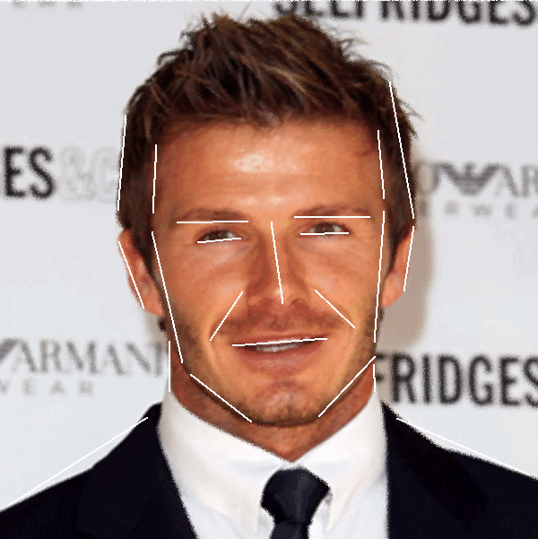
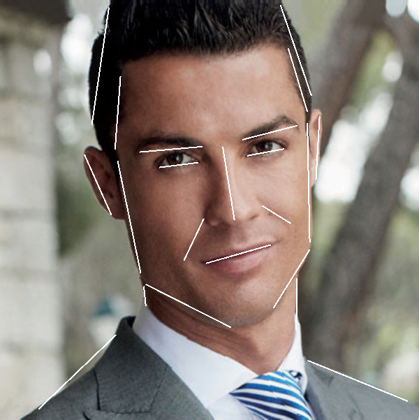

# Feature based Image Warping

Results:

Input Images:

After performing a morph:

David Beckham to Cristiano Ronaldo

Arnold Schwarzenegger to Terminator

Barack Obama to Dwayne Johnson

--------- Instructions on how to use the program ----------

All files(images, feature vectors, etc) need to be stored in the root directory.

Different types of files the program deals with:

1) Images (jpg and png formats)

2) Feature vector files (.dat extension) - Stores the feature points for a given
                                           image.

   The reason I use the word 'points' and not 'lines' is because the file
   actually stores 2D 'points' that make up the 'lines'.

   A typical dat file has the following format:

   x[1], y[1]
   x[2], y[2]
   ..
   ..
   x[n], y[n]

   where the ith feature line is formed by the points (x[i], y[i]) and (x[i+1], y[i+1])

   Note that n has to be an even number.

   These points are chosen by the user of course, by simply clicking the screen
   at the desired position.

   Not choosing an even number of points will lead to an /*Assertion error*/.

3) Parameter files - These are simple text files that contain one single line of
                     information - the constants a, b and p, used to
                     change the relative effect of the lines.

   The parameter file format is simply:

   a b p

   where a, b and p are the constant values mentioned above

Commands used to run the program:

./morpher source dest output frames <parameters>  
OR
./morpher -d source dest output frames <parameters>  

morpher - name of the executable generated  
source - source image name (with extension)  
dest - destination image name (with extension)  
output - name of the prefix of the files the program output generates
         (without extension) eg. if output = out,
         out1.png, out2.png, ..., out30.png assuming we want 30 frames  
frames - number of frames to be generated  
parameters - optional argument, the parameters file  

The -d option can be used if we want to use existing dat files for the given
input images. This is convenient if we want to perform the same morphing
operation we did before, with the exact same feature lines, but with different
constants a, b and p.

In case the optional argument <parameters> is not specified in the command,
the program will ask the user to input values for a, b and p at runtime on the
command prompt.

If the number of feature points for the 2 input images are not equal, this will
also result in an /*Assertion error*/.

The glm library was used for simplifying linear algebra operations.

The images I have produced in my results had parameter values for a, b and p as
1, 2 and 0 respectively.
